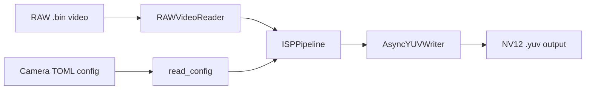

# Architecture

The project is organized around a single ISP pipeline that transforms Bayer RAW frames into NV12 YUV output.

## High-Level Flow

## Components

### `isp.config`

- Loads TOML camera configuration.
- Materializes LUTs and matrices as tensors on the selected device.

### `isp.io`

- `RAWVideoReader` reads 16-bit Bayer frames and crops embedded top/bottom lines.
- `NV12VideoReader` reads generated NV12 output for downstream validation or analysis.
- `AsyncYUVWriter` writes YUV frames on a background thread to reduce I/O bottlenecks.

### `isp.pipeline`

- `ISPPipeline` wires together the ISP stages as a `torch.nn.Module`.
- Stage parameters can be overridden from the command line without editing the camera config.

### `isp.pipeline.stages`

The default stage order is:

1. `DecompandBlackLevel`
2. `BayerDenoise`
3. `AWB`
4. `RawGreenExtract` when RAW-guided Y blending is enabled
5. `Demosaic`
6. `CCM`
7. `LTM`
8. `GammaCorrection`
9. `HistogramNormalization`
10. `PostGammaDenoise`
11. `SaturationAdjust`
12. `Sharpening`
13. `RGBtoYUV`

## Design Notes

- The core pipeline is device-aware and can run on CPU or CUDA.
- The CLI script is intentionally thin and delegates most behavior to `ISPPipeline`.
- The repository includes a synthetic RAW generator to make smoke testing and CI reproducible without shipping large binary assets.
